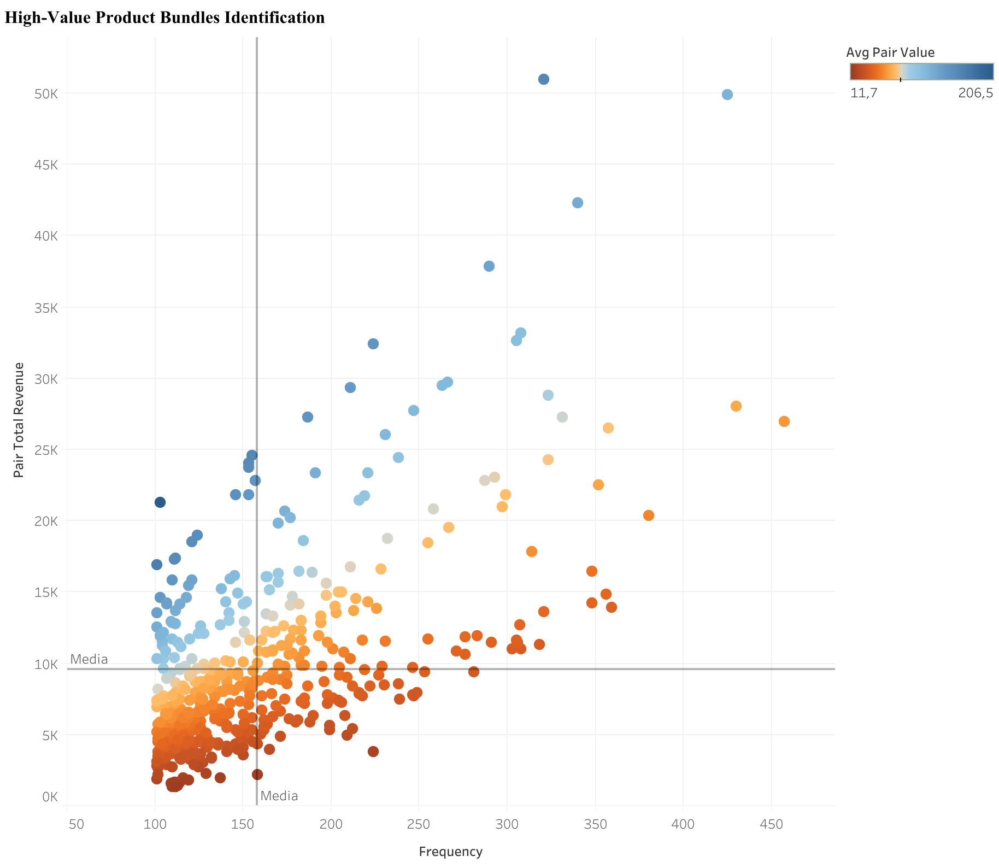
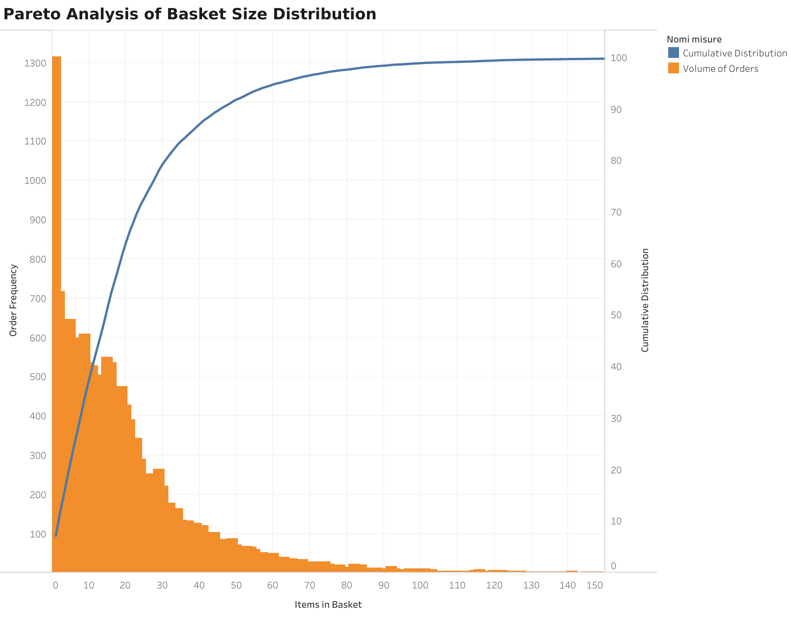
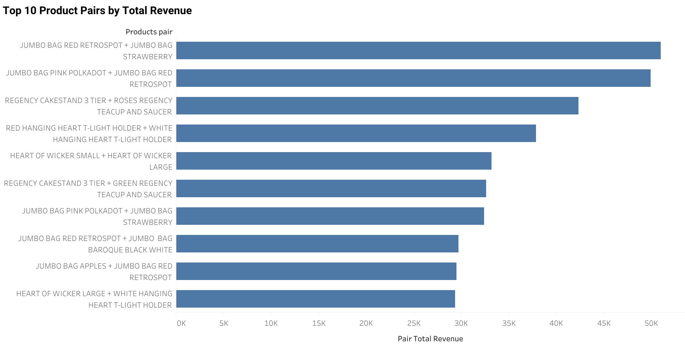

# UK Online Retail Analysis: Strategic Product Bundling & Customer Retention

## Project Background
This project analyzes a UK-based online retailer specializing in unique all-occasion giftware, operating primarily in the B2B/wholesale market from 2010-2011. The business model focuses on bulk orders to small retailers and gift shops across multiple countries.


**Key business metrics:**
- Total Revenue: £8,779,659
- Average Order Value (AOV): £477
- Customer Lifetime Value: £2,025
- Average unique products per order: 21 distinct SKUs
- Active customer base: 4,334 accounts

As a data analyst supporting this retailer, the **primary objective is to increase Average Order Value (AOV)** through strategic product bundling, while preventing customer churn through proactive RFM segmentation.

**Insights and recommendations are provided on the following key areas:**

- **Basket Behavior Analysis:** Product variety patterns and catalog exploration metrics
- **High-Revenue Product Bundles:** Frequently purchased pairs driving volume sales (£24K-£51K total revenue)
- **High-Value Premium Bundles:** Low-frequency pairs with exceptional unit economics (£133-£206 avg pair value)
- **Customer Segmentation (RFM):** Classification of 4,334 customers to identify upselling and retention opportunities
- **AOV Optimization Strategy:** Targeted recommendations to increase basket value from £477 to £550+ (+15%)

The SQL queries used to inspect and clean the data for this analysis can be found [here](sql/01_setup_and_cleaning.sql).

Targeted SQL queries regarding various business questions can be found [here](sql/).

An interactive Tableau dashboard used to report and explore customer segments and product bundles can be found [here](https://public.tableau.com/views/Project_17688308344020/Dashboard1?:language=it-IT&:sid=&:display_count=n&:origin=viz_share_link).

---

## Executive Summary

This analysis identifies **two distinct bundle strategies to increase AOV by 15% (£477 → £550)**, generating an estimated **+£878K in annual revenue**. 
- The first strategy targets **20 high-volume product pairs** generating £635K combined revenue, ideal for "One-Click" pre-packaged bundles with volume discounts. 
- The second strategy focuses on **20 premium pairs** with low frequency but exceptional unit economics (£133-£206 avg pair value), suitable for targeted upselling to high-value customers.
Customer segmentation reveals that **50.58% of customers (Active segment) generate 81% of revenue** (£7.13M), while 6.67% are at immediate churn risk (Alert segment, £484K revenue at stake).


*Product Bundles Identification: Top-right = High-Revenue (volume drivers), Top-left = High-Value (premium pairs)*

---

## Insights Deep Dive


### Basket Behavior Analysis: Why Bundle Strategy Makes Sense

**Objective:** Understand catalog exploration patterns to validate bundling and cross-selling strategies

> **Important Note:** Basket size in this analysis refers to **UNIQUE PRODUCTS (distinct SKUs)**, not total quantity. A customer buying 100 units of one product has basket size = 1, while buying 1 unit each of 20 products = basket size 20. This distinction is critical for interpreting cross-selling opportunities.

#### Product Variety Distribution

1. **50% of orders reach 15+ unique products (median threshold)**, suggesting engaged customers who actively browse the catalog. These high-variety baskets present upselling opportunities through "Complete Your Collection" and category expansion tactics.
   
2. **29.3% of orders (5,388 transactions) contain 10-20 unique products**, representing the high-engagement sweet spot where customers actively explore multiple product families. Incremental revenue opportunity per transaction through strategic bundling and cross-category recommendations.

3. **22.4% of orders (4,127 transactions) contain 30+ unique products**, indicating potential B2B/resellers, party planners, or mega-loyalists. These high-variety customers deserve premium treatment (account managers, wholesale pricing, trade portals).


*Pareto analysis: 50% of orders contain 15+ unique products, validating the relevance of bundle strategy for this business*

**Key Insight:** The high items-per-order behavior proves customers are ALREADY mentally bundling products (matching collections, complementary designs) - market basket analysis simply formalizes these patterns to make checkout easier and increase AOV.

---


### High-Revenue Product Bundles (Volume Strategy)

**Objective:** Increase transaction frequency and cart size for mass-market products

1. **Top bundle generates £50,964 from 321 co-purchases** (JUMBO BAG RED RETROSPOT + STRAWBERRY, £158.77 avg pair value). This represents the #1 cross-selling opportunity with proven customer demand across 1.7% of all transactions.

2. **10 bundles exceed 300 co-purchases**, indicating strong natural pairing behavior. These "Cash Cow" bundles are ideal candidates for prominent placement in checkout flows and homepage merchandising.

3. **Product families dominate high-frequency pairs**: 65% of top 20 involve JUMBO BAGS or REGENCY TEACUP collections, suggesting customers buy matching sets rather than random combinations. This validates "Complete the Collection" merchandising strategies over algorithmic recommendations.

4. **Average pair value ranges £59-£159** for volume bundles, fitting typical B2B restocking behavior. Lower unit economics are compensated by high transaction frequency (200-321 occurrences), generating £24K-£51K total revenue per pair.


*Revenue ranking of most valuable product combinations from high-frequency bundles*

**Key Insight:** These bundles should be **pre-packaged with 5% discount** to reduce checkout friction and increase impulse purchases among all customer segments.

---

### High-Value Premium Bundles (Margin Strategy)

**Objective:** Maximize profit per transaction through targeted upselling

1. **Top premium bundle averages £206.50 per pair** (DOORMAT NEW ENGLAND + HEARTS) despite only 103 co-purchases. This represents a **30% higher unit value** than the best volume bundle (£158.77), indicating luxury item pairing.

2. **Premium bundles have 55% lower frequency than volume bundles** (103-187 vs 200-321 occurrences) but maintain strong total revenue (£13K-£29K) due to superior unit economics. This creates a high-margin, low-volume opportunity channel.

**Key Insight:** These bundles require **personalized recommendations for Active High-Value customers** (50% of base, £3,252 LTV) through email campaigns rather than homepage promotion, to avoid diluting premium positioning.

---


### Customer Segmentation (RFM Analysis)

**Objective:** Align bundle strategies with customer lifecycle stages

**RFM Segment Overview:**

| Segment | Customers | % of Base | Avg LTV | Avg Orders | Total Revenue | % Revenue | Priority |
|---------|-----------|-----------|---------|------------|---------------|-----------|----------|
| **🟢 Active** | 2,192 | 50.58% | £3,252.87 | 6.5 | £7,130,281 | **81.21%** | Premium bundles |
| **⚪ One-Shot** | 1,505 | 34.73% | £418.34 | 1.0 | £629,595 | 7.17% | Reactivation |
| **🟡 Churned** | 348 | 8.03% | £1,539.15 | 3.6 | £535,625 | 6.10% | Win-back |
| **🔴 Alert** | 289 | 6.67% | £1,675.29 | 4.6 | £484,159 | 5.51% | Retention |
| **TOTAL** | 4,334 | 100% | £2,025 | 4.2 | £8,779,659 | 100% | - |

**Critical Insights:**

1. **Active segment (50.58%, 2,192 customers) generates 81% of revenue** (£7.13M) with 6.5 average orders and £3,252 lifetime value. This segment should receive **premium bundle upsells** (doormat pairs, Regency luxury sets) to increase AOV from £477 to £600+ through personalized email campaigns.

2. **One-Shot segment (34.73%, 1,505 customers) contributes only 7% of revenue** (£629K) with single purchases averaging £418. These customers need **reactivation campaigns featuring high-revenue volume bundles** (JUMBO BAG collections) to encourage repeat purchases and collection completion behavior.

3. **Alert segment (6.67%, 289 customers) represents £484K immediate revenue risk** with 4.6 historical orders and £1,675 LTV. These customers should receive **"Complete the Set" bundle offers** (high-revenue pairs from previously purchased collections) within 48 hours to prevent transition to Churned status.

4. **Churned segment (8.03%, 348 customers) has lost £535K in potential revenue** with 3.6 historical orders. Win-back campaigns should emphasize **volume bundle discounts** (10-15% off on JUMBO BAG sets) paired with free shipping to re-engage these lapsed buyers.

**Key Insight:** Revenue concentration (81% from 50% of customers) validates the prioritization of Active segment retention over new customer acquisition, with premium bundle upselling as the primary growth lever.

---


## Recommendations

Based on the insights and findings above, we would recommend the **marketing, merchandising, and e-commerce teams** to consider the following:

### 1. Launch "One-Click Stock-Up" Bundles (High-Revenue Strategy)

**Target:** All customer segments | **Focus:** Volume driver pairs (£24K-£51K revenue)

**Action:**
- Pre-package top 10 high-revenue pairs (JUMBO BAG combinations, REGENCY TEACUP sets) with **5% bundle discount**
- Feature prominently on homepage carousel and checkout page ("Frequently Bought Together")
- Create SKU-level bundles to enable one-click add-to-cart functionality
- Add visual indicators: "Save £X when bundled" to highlight value proposition

---

### 2. Deploy Personalized Premium Bundle Upsells (High-Value Strategy)

**Target:** Active High-Value segment |
**Focus:** Premium pairs (£133-£206 avg value)

**Action:**
- Implement targeted email campaign to top 20% customers showcasing **doormat bundles** (£167-£206 avg) and **Regency luxury sets** (£141-£158 avg)
- Create personalized product recommendations based on previous purchases (if bought REGENCY TEAPOT → suggest SUGAR BOWL + MILK JUG bundle)
- Offer **free shipping on £750+ orders** featuring premium bundles to incentivize large basket sizes

---

### 3. Create Volume Tiering to Push AOV Threshold (Price Optimization)

**Target:** All customers, especially those in £450-£500 range (45% of orders) | **Focus:** Incentivize larger basket sizes

**Action:**
- Implement dynamic pricing tiers visible during checkout with progress bar:
  - **£450-£499:** Standard shipping (baseline)
  - **£500-£749:** 5% discount + free shipping
  - **£750+:** 10% discount + free priority shipping + free premium bundle sample (£50 value)
- Display real-time messaging: "Add £23 more to unlock 5% discount!"
- Use color-coded progress bar (orange → green) to gamify threshold achievement

**Expected Impact:**
- Shift 45% of orders from £450-£499 range → £500-£549 range (+£50-£75 per order)
- Increase overall AOV from **£477 → £525** (+10%)
- **Total annual revenue lift: +£878K** (18,405 orders × £48 average increase)

---

### 4. Win-Back Campaign for Churned & One-Shot Segments (Revenue Recovery)

**Target:** Churned (348 customers, £535K lost) + One-Shot (1,505 customers, £629K untapped) | **Focus:** Volume bundle discounts

**Action:**
- Offer **15% discount + free shipping** with 7-day expiration to create urgency
- Segment messaging:
  - Churned: "We miss you! Here's 15% off to welcome you back"
  - One-Shot: "Discover what 2,192 customers are buying - complete your collection"

---


## Assumptions and Caveats

Throughout the analysis, multiple assumptions were made to manage challenges with the data. These assumptions and caveats are noted below:

1. **Cancelled invoices (prefix 'C') were excluded entirely** rather than netted against original orders, as matching cancelled invoices to originals was not feasible without additional business logic. This may slightly overstate total revenue if some cancellations are missing from the dataset.

2. **Transactions with missing or zero CustomerID values (135,080 records, ~25% of dataset) were excluded entirely** rather than analyzed separately or imputed, as customer-level metrics (RFM segmentation, churn analysis, interpurchase intervals) require unique identifiers to track individual behavior over time. This exclusion ensures data quality for loyalty and retention analyses but may understate total business performance, as guest checkouts and unregistered purchases are not reflected in reported revenue or order volume figures.

3. **Orders with >50 unique products (outliers) were excluded from market basket analysis**, as these likely represent bulk wholesale orders with different purchasing logic. This affects <1% of transactions but prevents skewing of co-purchase frequency calculations.


---

## Repository Structure

```
uk-retail-analysis/
├── README.md                                    # Project overview (you are here)
├── data/
│   ├── online_retail_sample.csv                 # 1,000-row sample for GitHub
│   └── data_dictionary.md                       # Column descriptions
├── sql/
│   ├── 01_setup_and_cleaning.sql                # Database setup + data quality checks
│   ├── 02_exploratory_analysis.sql              # Sales, AOV, basket size profiling
│   ├── 03_market_basket_analysis.sql            # Product pair co-occurrence (self-join)
│   └── 04_rfm_segmentation.sql                  # Customer lifecycle analysis
├── visualizations/
│   ├── rfm_customer_distribution.png            # Customers distribution
│   ├── product_bundles_quadrant.png             # Bundle classification matrix
│   ├── top_pairs_revenue.png                    # Revenue-ranked pairs
│   └── basket_size_pareto.png                   # Order size distribution
└── results/
    ├── top_20_product_pairs.csv                 # High-revenue bundles (volume strategy)
    ├── top_20_product_pairsu_most_profit.csv    # High-value bundles (margin strategy)
    └── rfm_customer_segments.csv                # Customer segments with metrics
```

---

## Technical Skills Demonstrated

### SQL Techniques
- **Self-Joins:** Market basket analysis using advanced join logic to identify product co-occurrence patterns while eliminating duplicate pairs (A+B = B+A)
- **Window Functions:** LAG, DATEDIFF for interpurchase time calculation and churn prediction modeling
- **CTEs (Common Table Expressions):** Multi-step RFM segmentation with nested queries for lifecycle classification
- **Views:** Reusable analytical layers for sales/returns separation and clean data abstraction

### Data Analysis
- **Market Basket Analysis:** Association rule mining for cross-selling strategy development with dual classification (volume vs. margin)
- **Customer Segmentation:** RFM modeling with custom thresholds adapted for B2B wholesale behavior patterns
- **Cohort Analysis:** Lifecycle stage classification and churn risk scoring using interpurchase time metrics
- **Pareto Analysis:** 80/20 rule application to basket size distribution for bundle strategy validation

### Visualization (Tableau)
- **Quadrant Charts:** Portfolio-style bundle classification matrix (frequency × revenue) for strategic prioritization
- **Scatter Plots:** RFM distribution with interactive segment filtering and drill-down capabilities
- **Pareto Analysis:** Cumulative distribution visualization for 80/20 rule validation
- **Bar Charts:** Revenue-ranked product pairs with dual-axis frequency overlay

---


## Data Source

**Dataset:** UCI Machine Learning Repository - Online Retail Dataset  
**Link:** https://archive.ics.uci.edu/ml/datasets/online+retail

---

## Contact

**LinkedIn:** [linkedin.com/in/yourprofile](https://www.linkedin.com/in/falconemichele00/)  
**Email:** falconemichele4316@gmail.com

*This project demonstrates advanced SQL and business analysis skills for junior/mid-level data analyst roles. Open to opportunities in e-commerce analytics, retail optimization, and customer intelligence!*

---

*⭐ If this project was helpful, please consider starring the repository!*
