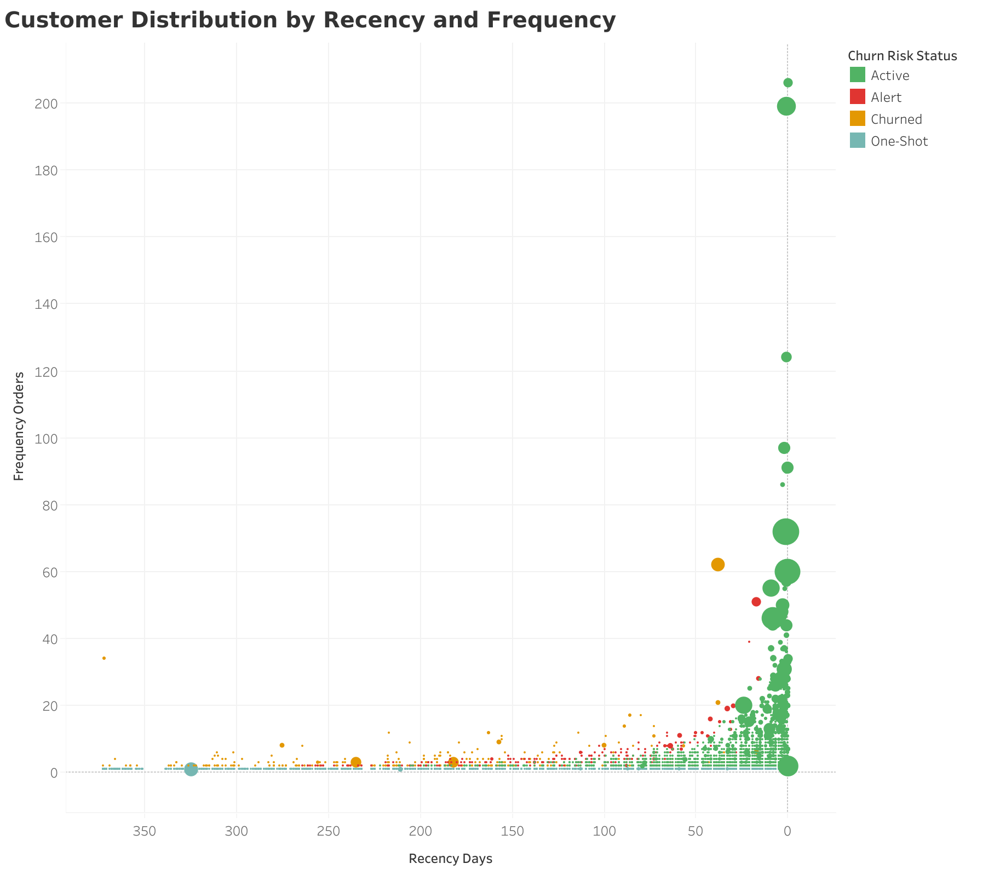

# UK Online Retail Analysis: Strategic Product Bundling 

### 📊 Project Snapshot
| Metric | Value |
| :--- | :--- |
| **Goal** | Increase AOV (£477 → £550) & Reduce Churn |
| **Tools** | **SQL** (Advanced), **Tableau**, RFM Segmentation |
| **Key Insight** | Bundling strategy can generate **+£878K/year** |
| **Links** | [📂 SQL Scripts](sql/) • [📈 Tableau Dashboard](https://public.tableau.com/views/Project_17688308344020/Dashboard1?:language=it-IT&:sid=&:display_count=n&:origin=viz_share_link) |

---

## 💡 Executive Summary

This analysis identifies **two distinct bundle strategies to increase AOV by 15% (£477 → £550)**, generating an estimated **+£878K in annual revenue**. 

**The Data Driver: Why Bundling?**

Exploratory analysis revealed a critical insight: **50% of all orders contain 15+ unique products** (median basket size). This proves customers are *already* mentally building collections—not just buying individual items. The strategic opportunity is to formalize this behavior through intelligent bundling to reduce friction at checkout and boost Average Order Value.

- The first strategy targets **20 high-volume product pairs** generating £635K combined revenue, ideal for "One-Click" pre-packaged bundles with volume discounts. 
- The second strategy focuses on **20 premium pairs** with low frequency but exceptional unit economics (£133-£206 avg pair value), suitable for targeted upselling to high-value customers.

**Targeting Strategy:**

Customer segmentation (RFM Analysis) reveals that **50.58% of customers (Active segment)** generate **81% of total revenue** (£7.13M). These customers should receive Premium bundle offers to maximize margin. Meanwhile, the **Alert segment (6.67% of base, £484K revenue at risk)** requires immediate Volume bundle interventions to prevent churn.

<p align="center">
  
</p>
*Strategic Bundle Classification Matrix: Top-Right = High-Revenue Volume Drivers. Top-Left = High-Value Premium Pairs.*

---

## 🚀 Strategic Recommendations

Based on the analysis, I recommend the following actions for the marketing, merchandising, and e-commerce teams:

| Business Goal | Data Insight (The "Why") | Strategic Action (The "What") |
| :--- | :--- | :--- |
| **📈 Increase AOV** | 50% of customers buy 15+ products per order. Top 20 product pairs were purchased together 200-321 times each. | **Launch "One-Click Bundles"**: Pre-package top 20 High-Revenue pairs (Jumbo Bags, Regency Teacups) with 5% discount. Feature prominently on homepage carousel and "Frequently Bought Together" section at checkout. |
| **💰 Maximize Margin** | Premium product pairs are worth 30% more per transaction (£206 avg) than volume bundles (£158 avg). | **Targeted Premium Upsell**: Email campaigns showcasing High-Value pairs exclusively to "Active High-Value" segment (top 50% of customer base, £3,252 avg LTV). |
| **🔄 Prevent Churn** | 289 customers (6.7% of base) are showing signs of inactivity. They represent £484K in at-risk revenue. | **Proactive Win-Back Campaign**: Send automated "Complete the Set" bundle offers within 48 hours of inactivity trigger. Offer 15% discount on previously purchased product collections with 7-day urgency timer. |

---

## 🔍 Technical Deep Dive (Click to expand)

<details>
<summary><strong>1. Basket Behavior Analysis: Why Bundle Strategy Makes Sense</strong></summary>

### Objective
Understand catalog exploration patterns to validate bundling and cross-selling strategies.

> **Important Note:** Basket size in this analysis refers to **UNIQUE PRODUCTS (distinct SKUs)**, not total quantity. A customer buying 100 units of one product has basket size = 1, while buying 1 unit each of 20 products = basket size 20. This distinction is critical for interpreting cross-selling opportunities.

### Product Variety Distribution

**Key Findings:**

1. **50% of orders reach 15+ unique products (median threshold)**, suggesting engaged customers who actively browse the catalog. These high-variety baskets present upselling opportunities through "Complete Your Collection" and category expansion tactics.

2. **29.3% of orders (5,388 transactions) contain 10-20 unique products**, representing the high-engagement sweet spot where customers actively explore multiple product families. This is the prime segment for incremental revenue growth through strategic bundling and cross-category recommendations.

3. **22.4% of orders (4,127 transactions) contain 30+ unique products**, indicating potential B2B/resellers, party planners, or mega-loyalists. These high-variety customers deserve premium treatment (dedicated account managers, wholesale pricing tiers, trade portals).


*Pareto analysis showing order distribution by unique product count. The high items-per-order behavior validates the relevance of bundle strategy.*

**Strategic Insight:**  
The high items-per-order behavior proves customers are ALREADY mentally bundling products (matching collections, complementary designs). Market basket analysis simply formalizes these patterns to make checkout easier and increase AOV.

---

### High-Revenue Product Bundles (Volume Strategy)

**Objective:** Increase transaction frequency and cart size for mass-market products.

**Detailed Findings:**

1. **Top bundle generates £50,964 from 321 co-purchases** (JUMBO BAG RED RETROSPOT + STRAWBERRY, £158.77 avg pair value). This represents the #1 cross-selling opportunity with proven customer demand across 1.7% of all transactions.

2. **10 bundles exceed 300 co-purchases**, indicating strong natural pairing behavior. These "Cash Cow" bundles are ideal candidates for prominent placement in checkout flows and homepage merchandising.

3. **Product families dominate high-frequency pairs**: 65% of top 20 involve JUMBO BAGS or REGENCY TEACUP collections, suggesting customers buy matching sets rather than random combinations. This validates "Complete the Collection" merchandising strategies over pure algorithmic recommendations.

4. **Average pair value ranges £59-£159** for volume bundles, fitting typical B2B restocking behavior. Lower unit economics are compensated by high transaction frequency (200-321 occurrences), generating £24K-£51K total revenue per pair.


*Revenue ranking of most valuable product combinations from high-frequency bundles.*

**Implementation Recommendation:**  
These bundles should be **pre-packaged with 5% discount** to reduce checkout friction and increase impulse purchases among all customer segments. Create dedicated SKUs to enable one-click add-to-cart functionality.

---

### High-Value Premium Bundles (Margin Strategy)

**Objective:** Maximize profit per transaction through targeted upselling.

**Detailed Findings:**

1. **Top premium bundle averages £206.50 per pair** (DOORMAT NEW ENGLAND + HEARTS) despite only 103 co-purchases. This represents a **30% higher unit value** than the best volume bundle (£158.77), indicating luxury item pairing behavior.

2. **Premium bundles have 55% lower frequency than volume bundles** (103-187 vs 200-321 occurrences) but maintain strong total revenue (£13K-£29K) due to superior unit economics. This creates a high-margin, low-volume opportunity channel.

3. **Premium pairs cluster around home décor categories** (Doormats, Regency luxury sets) rather than consumables, suggesting these are gift purchases or special occasion orders with higher willingness-to-pay.

**Implementation Recommendation:**  
These bundles require **personalized recommendations for Active High-Value customers** (50% of base, £3,252 LTV) through targeted email campaigns rather than homepage promotion, to avoid diluting premium positioning. Use previous purchase history to customize bundle suggestions.

</details>

<details>
<summary><strong>2. Customer Segmentation (RFM Analysis)</strong></summary>

### Objective
Align bundle strategies with customer lifecycle stages using Recency, Frequency, and Monetary value scoring.

### Methodology
Used SQL window functions (`LAG`, `DATEDIFF`) to calculate interpurchase time and classify 4,334 customers into lifecycle segments based on:
- **Recency:** Days since last purchase
- **Frequency:** Total number of orders
- **Monetary:** Customer Lifetime Value (LTV)
<p align="center">
  
</p>
*Customer segmentation based on RFM analysis (Recency, Frequency, Monetary value) identifying four behavioral groups: Active, Alert, Churned, and One-Shot customers.*

### RFM Segment Overview

| Segment | Customers | % of Base | Avg LTV | Avg Orders | Total Revenue | % Revenue | Priority Action |
|---------|-----------|-----------|---------|------------|---------------|-----------|-----------------|
| **🟢 Active** | 2,192 | 50.58% | £3,252.87 | 6.5 | £7,130,281 | **81.21%** | Premium bundles upsell |
| **⚪ One-Shot** | 1,505 | 34.73% | £418.34 | 1.0 | £629,595 | 7.17% | Reactivation campaigns |
| **🟡 Churned** | 348 | 8.03% | £1,539.15 | 3.6 | £535,625 | 6.10% | Win-back offers |
| **🔴 Alert** | 289 | 6.67% | £1,675.29 | 4.6 | £484,159 | 5.51% | Immediate retention |
| **TOTAL** | 4,334 | 100% | £2,025 | 4.2 | £8,779,659 | 100% | - |

### Critical Insights & Actions

1. **Active Segment (50.58%, 2,192 customers) generates 81% of revenue** (£7.13M) with 6.5 average orders and £3,252 lifetime value.  
   *Action:* This segment should receive **premium bundle upsells** (doormat pairs, Regency luxury sets) to increase AOV from £477 to £600+ through personalized email campaigns. Focus on margin expansion rather than volume.

2. **One-Shot Segment (34.73%, 1,505 customers) contributes only 7% of revenue** (£629K) with single purchases averaging £418.  
   *Action:* These customers need **reactivation campaigns featuring high-revenue volume bundles** (JUMBO BAG collections) with "Complete Your Collection" messaging to encourage repeat purchases. Offer 10% discount with free shipping on second order.

3. **Alert Segment (6.67%, 289 customers) represents £484K immediate revenue risk** with 4.6 historical orders and £1,675 LTV. These are previously active customers showing declining engagement.  
   *Action:* Send **"Complete the Set" bundle offers** (high-revenue pairs from previously purchased collections) within 48 hours of inactivity trigger. Use urgency tactics (limited-time 15% discount) to prevent transition to Churned status.

4. **Churned Segment (8.03%, 348 customers) has lost £535K in potential revenue** with 3.6 historical orders but no recent activity.  
   *Action:* Win-back campaigns should emphasize **volume bundle discounts** (10-15% off on JUMBO BAG sets) paired with free shipping. A/B test "We Miss You" vs "New Arrivals" messaging to identify effective reactivation triggers.

**Key Strategic Insight:**  
Revenue concentration (81% from 50% of customers) validates the prioritization of Active segment retention over new customer acquisition, with premium bundle upselling as the primary growth lever.

</details>

<details>
<summary><strong>3. Data Cleaning & Assumptions</strong></summary>

Throughout the analysis, multiple assumptions were made to manage data quality challenges. These are documented for transparency:

### Data Exclusions

1. **Cancelled invoices (prefix 'C') were excluded entirely** rather than netted against original orders, as matching cancelled invoices to originals was not feasible without additional business logic. This may slightly overstate total revenue if some cancellations are missing from the dataset.

2. **Transactions with missing or zero CustomerID values (135,080 records, ~25% of dataset) were excluded entirely** rather than analyzed separately or imputed. Customer-level metrics (RFM segmentation, churn analysis, interpurchase intervals) require unique identifiers to track individual behavior over time. This exclusion ensures data quality for loyalty and retention analyses but may understate total business performance, as guest checkouts and unregistered purchases are not reflected in reported revenue or order volume figures.

3. **Orders with >50 unique products (outliers) were excluded from market basket analysis**, as these likely represent bulk wholesale orders with different purchasing logic. This affects <1% of transactions but prevents skewing of co-purchase frequency calculations.

### Analytical Choices

- **Basket Size Definition:** Counted as UNIQUE SKUs per transaction, not total quantity. This choice emphasizes product variety over volume.
- **RFM Thresholds:** Custom thresholds adapted for B2B wholesale behavior patterns (higher order values, longer interpurchase times) rather than using standard retail benchmarks.
- **Bundle Classification:** Pairs classified by both frequency AND total revenue to identify distinct Volume vs. Premium strategies.

</details>

---

## 🛠️ Repository Structure

```
uk-retail-analysis/
├── README.md                                    # Project overview (you are here)
├── data/
│   ├── online_retail_sample.csv                 # 1,000-row sample for GitHub
│   └── data_dictionary.md                       # Column descriptions
├── sql/
│   ├── 01_setup_and_cleaning.sql                # Database setup + data quality checks
│   ├── 02_exploratory_analysis.sql              # Sales, AOV, basket size profiling
│   ├── 03_market_basket_analysis.sql            # Product pair co-occurrence (self-join)
│   └── 04_rfm_segmentation.sql                  # Customer lifecycle analysis
├── visualizations/
│   ├── rfm_customer_distribution.png            # Customer segment distribution
│   ├── product_bundle_matrix.png                # Bundle classification matrix
│   ├── top_pairs_revenue.png                    # Revenue-ranked pairs
│   └── basket_size_pareto.png                   # Order size distribution
└── results/
    ├── top_20_product_pairs.csv                 # High-revenue bundles (volume strategy)
    ├── top_20_product_pairs_most_profit.csv     # High-value bundles (margin strategy)
    └── rfm_customer_segments.csv                # Customer segments with metrics
```

---

## 👨‍💻 Technical Skills Demonstrated

### SQL Techniques
- **Self-Joins:** Market basket analysis using advanced join logic to identify product co-occurrence patterns while eliminating duplicate pairs (A+B = B+A)
- **Window Functions:** `LAG`, `DATEDIFF` for interpurchase time calculation and churn prediction modeling
- **CTEs (Common Table Expressions):** Multi-step RFM segmentation with nested queries for lifecycle classification
- **Views:** Reusable analytical layers for sales/returns separation and clean data abstraction

### Data Analysis
- **Market Basket Analysis:** Association rule mining for cross-selling strategy development with dual classification (volume vs. margin)
- **Customer Segmentation:** RFM modeling with custom thresholds adapted for B2B wholesale behavior patterns
- **Cohort Analysis:** Lifecycle stage classification and churn risk scoring using interpurchase time metrics
- **Pareto Analysis:** 80/20 rule application to basket size distribution for bundle strategy validation

### Visualization (Tableau)
- **Quadrant Charts:** Portfolio-style bundle classification matrix (frequency × revenue) for strategic prioritization
- **Scatter Plots:** RFM distribution with interactive segment filtering and drill-down capabilities
- **Pareto Analysis:** Cumulative distribution visualization for 80/20 rule validation
- **Bar Charts:** Revenue-ranked product pairs with dual-axis frequency overlay

---

## 📊 Data Source

**Dataset:** UCI Machine Learning Repository - Online Retail Dataset  
**Link:** [https://archive.ics.uci.edu/ml/datasets/online+retail](https://archive.ics.uci.edu/ml/datasets/online+retail)

---

## 📧 Contact

**Michele Falcone**  
[LinkedIn](https://www.linkedin.com/in/falconemichele00/) | [Email](mailto:falconemichele4316@gmail.com)

*This project demonstrates advanced SQL and business analysis skills for junior/mid-level data analyst roles. Open to opportunities in e-commerce analytics, retail optimization, and customer intelligence!*

---

*⭐ If this project was helpful, please consider starring the repository!*
